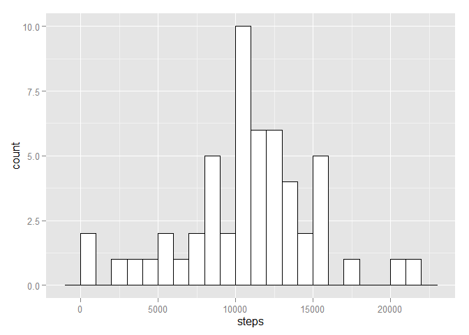
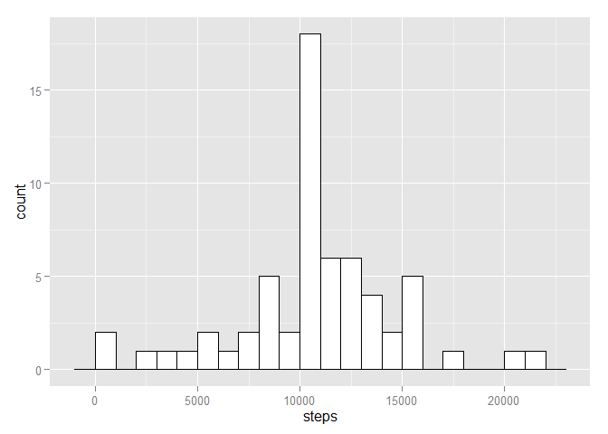
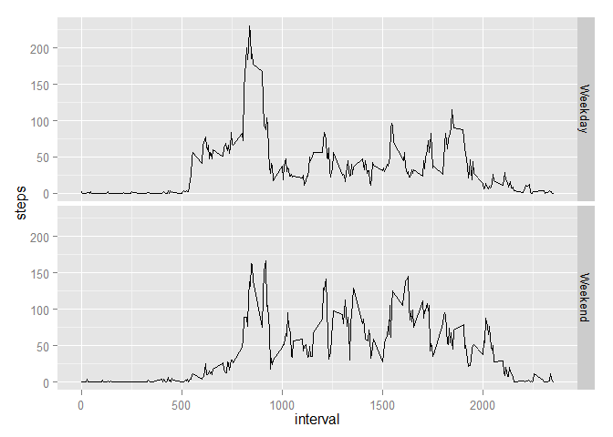

# Reproducible Research: Peer Assessment 1
Alessandro Pistilli  
Friday, October 17, 2014  

The following document describes the observations of an anonymous individual over a period of 2 months (October and November 2012).
The collected data is stored in a .csv and will be loaded at the beginning of the document.

### the dataset
The data for this assignment can be downloaded from the course web site:


Dataset: Activity monitoring data <https://d396qusza40orc.cloudfront.net/repdata%2Fdata%2Factivity.zip> [52K]

The variables included in this dataset are:

* **steps**: Number of steps taking in a 5-minute interval (missing values are coded as NA)
* **date**: The date on which the measurement was taken in YYYY-MM-DD format
* **interval**: Identifier for the 5-minute interval in which measurement was taken

The dataset is stored in a comma-separated-value (CSV) file and there are a total of **17,568** observations in this dataset.

## Loading and preprocessing the data


```r
library(ggplot2)
library(dplyr, quietly=TRUE)
```

```
## 
## Attaching package: 'dplyr'
## 
## The following objects are masked from 'package:stats':
## 
##     filter, lag
## 
## The following objects are masked from 'package:base':
## 
##     intersect, setdiff, setequal, union
```

```r
data <- read.csv(file="activity.csv")
```


## What is mean total number of steps taken per day?

**number of steps taken each day**


```r
aggregate <- aggregate(steps ~ date, data=data, sum)
ggplot(aggregate, aes(x=steps)) + geom_histogram(binwidth=1000, colour="black", fill="white")
```

 

**Mean and Median of the total number of steps taken per day**

```r
mean(aggregate$steps)
```

```
## [1] 10766.19
```

```r
median(aggregate$steps)
```

```
## [1] 10765
```

## What is the average daily activity pattern?


```r
activity_pattern <- aggregate(steps ~ interval, data=data, mean)
ggplot(activity_pattern,
       aes(interval, steps), 
       main="Activity pattern during the day") + geom_line()
```

 

***Which 5-minute interval, on average across all the days in the dataset, contains the maximum number of steps?***

```r
activity_pattern[which.max(activity_pattern$steps),1]
```

```
## [1] 835
```


## Imputing missing values

**Calculate and report the total number of missing values in the dataset (i.e. the total number of rows with NAs)**


```r
sum(is.na(data))
```

```
## [1] 2304
```

**Devise a strategy for filling in all of the missing values in the dataset.**
To fill missing values I'll use the mean of that interval across the whole experiment
I'll call this dataset new_data


```r
new_data <- inner_join(data,activity_pattern, by= "interval")
for(i in 1:nrow(new_data)) {
  if(is.na(new_data[i,1])){
    new_data[i,1] <- new_data[i,4]
  }  
}
new_data <- new_data[,1:3]
names(new_data) <- c("steps", "date","interval")
```

Let's see if the dataset with the missing data shows different results.

**number of steps taken each day**


```r
aggregate <- aggregate(steps ~ date, data=new_data, sum)
ggplot(aggregate, aes(x=steps)) + geom_histogram(binwidth=1000, colour="black", fill="white")
```

 

**Mean and Median of the total number of steps taken per day**

```r
mean(aggregate$steps)
```

```
## [1] 10766.19
```

```r
median(aggregate$steps)
```

```
## [1] 10766.19
```

## Are there differences in activity patterns between weekdays and weekends?

I will create a new dataset containing a new factor variable, indicating weekends vs weekdays


```r
data_with_days <- new_data
for(i in 1:nrow(data_with_days)) {
  if(weekdays(as.Date(data_with_days[i,2])) %in% c("Saturday","Sunday")){
    data_with_days[i,4] <- "Weekend"
  } else {
    data_with_days[i,4] <- "Weekday"
  }
}
names(data_with_days)[4] <- "day"

activity_pattern_days <- aggregate(steps ~ interval + day, data=data_with_days, mean)
sp <- ggplot(activity_pattern_days,
       aes(interval, steps), 
       main="Activity pattern during the day") + geom_line()
sp + facet_grid(day ~ .)
```

 
